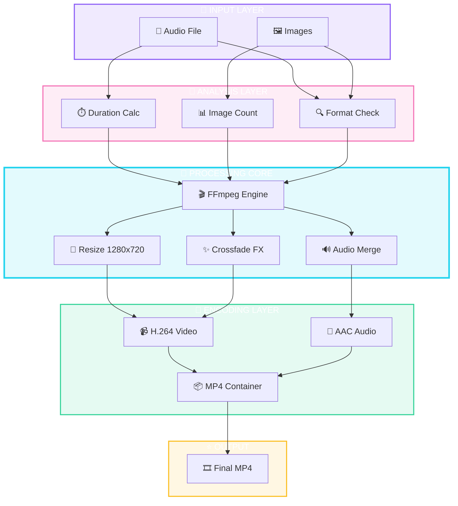
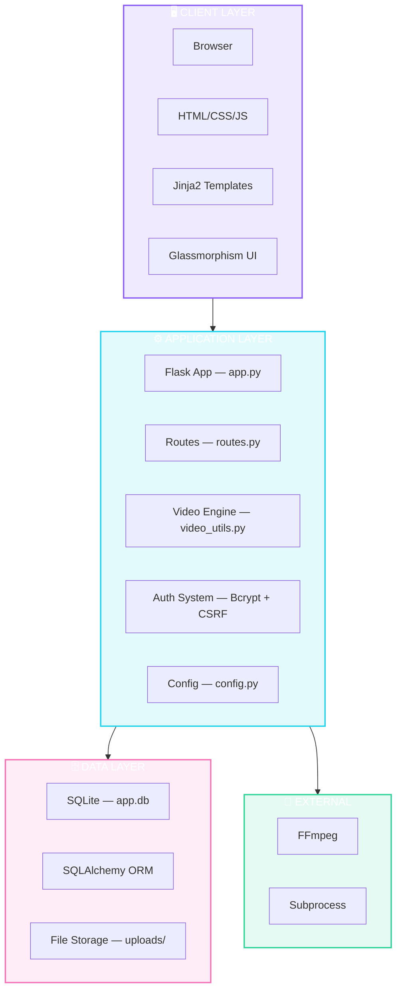
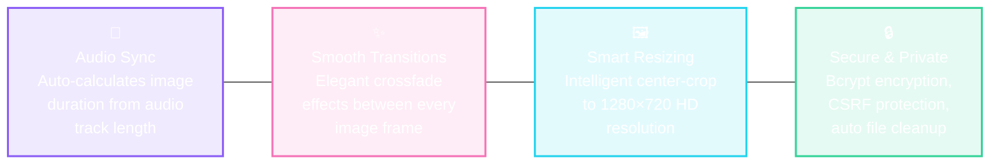

<div align="center">

<!-- LOGO -->


<h1>
  
</h1>

<p><strong>AI-Powered Video Creation Engine</strong></p>
<p>Turn your photos & audio into cinematic MP4 videos — automatically.</p>

<!-- BADGES -->
<p>
  
  
  
  
</p>

<p>
  
  
</p>

</div>

---

## 🎬 Application Workflow


---

## 🧠 Neural Video Generation Engine



### Core Processing Parameters

| Parameter | Value | Description |
|---|---|---|
| **Resolution** | `1280×720` | HD Output |
| **Frame Rate** | `24 FPS` | Cinematic smoothness |
| **Transition** | `0.5s` | Crossfade duration |
| **Audio Codec** | `AAC` | High-quality audio |
| **Video Codec** | `H.264` | Universal compatibility |
| **Output Format** | `MP4` | Standard container |

---

## 🏗️ System Architecture



---

## ✨ Features



---

## 🚀 Quick Start

```bash
# 1. Clone the repository
git clone https://github.com/issu321/Video-App.git
cd Video-App

# 2. Install FFmpeg (if not already installed)
# macOS: brew install ffmpeg
# Ubuntu: sudo apt install ffmpeg
# Windows: Download from ffmpeg.org and add to PATH

# 3. Install Python dependencies
pip install -r requirements.txt

# 4. Run the application
python app.py

# 5. Open browser → http://localhost:5000
```

---

## 📁 Project Structure

```
Video-App/
├── app.py              # Application entry point
├── config.py           # Configuration settings
├── extensions.py       # Flask extensions (DB, Login, Bcrypt, CSRF)
├── models.py           # Database models
├── routes.py           # All application routes
├── video_utils.py      # Video generation engine (FFmpeg)
├── requirements.txt    # Python dependencies
├── README.md           # This file
├── static/
│   └── css/
│       └── style.css   # Premium glassmorphism theme
├── templates/          # Jinja2 HTML templates
│   ├── base.html
│   ├── home.html
│   ├── login.html
│   ├── register.html
│   ├── dashboard.html
│   ├── new_project.html
│   ├── processing.html
│   └── result.html
└── uploads/            # File storage (auto-created)
    ├── audio/
    ├── images/
    └── output/
```

---

## ⚙️ Configuration

Edit `config.py` to customize:

| Parameter | Default | Description |
|---|---|---|
| `VIDEO_RESOLUTION` | `1280x720` | Output video dimensions |
| `VIDEO_FPS` | `24` | Frames per second |
| `VIDEO_TRANSITION_SECONDS` | `0.5` | Crossfade duration |
| `MAX_CONTENT_LENGTH` | `100MB` | Maximum upload size |

---

## 🛠️ Tech Stack

| Layer | Technology |
|---|---|
| **Backend** | Flask, Python 3.8+ |
| **Database** | SQLite, SQLAlchemy ORM |
| **Auth** | Flask-Login, Flask-Bcrypt, Flask-WTF (CSRF) |
| **Video Engine** | FFmpeg (subprocess) |
| **Frontend** | HTML5, CSS3, Jinja2, Vanilla JS |
| **UI Design** | Glassmorphism, Custom Animations |

---

## 🧑‍💻 Developer

<div align="center">

**Mohammed Usman**

*Full Stack Developer*

<p>
  <a href="https://github.com/issu321">
    
  </a>
  <a href="https://issu321.github.io/issu321">
    
  </a>
</p>

<p>
  <a href="mailto:jaafreeusman@gmail.com">
    
  </a>
  <a href="https://wa.me/918884294749">
    
  </a>
</p>

<p>
  <a href="https://github.com/issu321/Video-App">
    
  </a>
</p>

</div>

---

<div align="center">

**Crafted with precision by Mohammed Usman**

Video Studio © 2024 — All rights reserved

</div>
