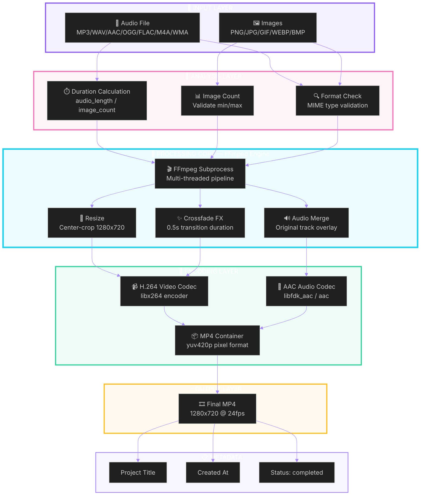
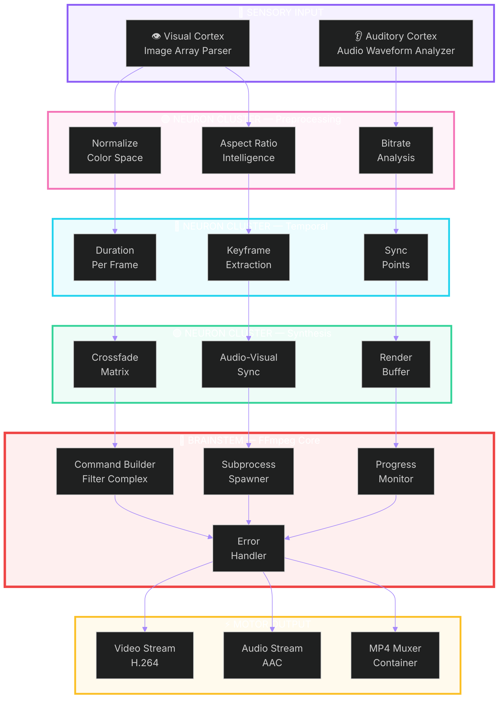
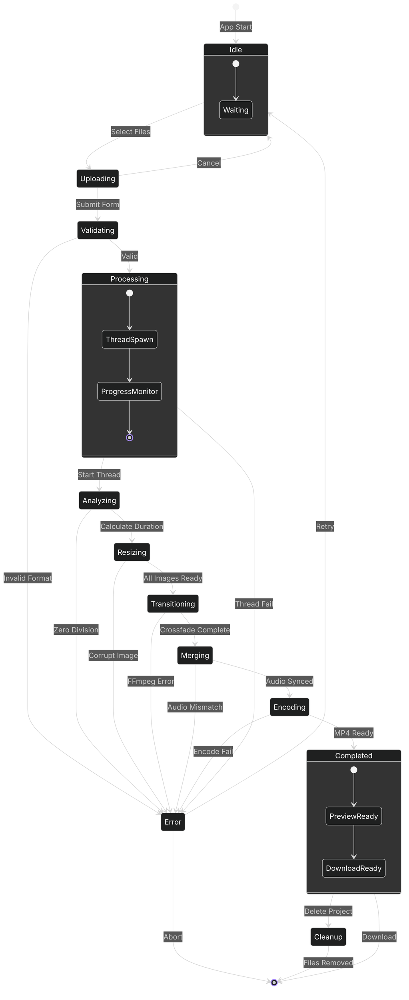
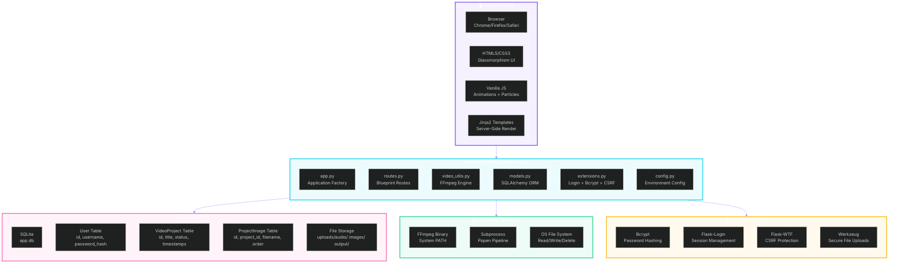
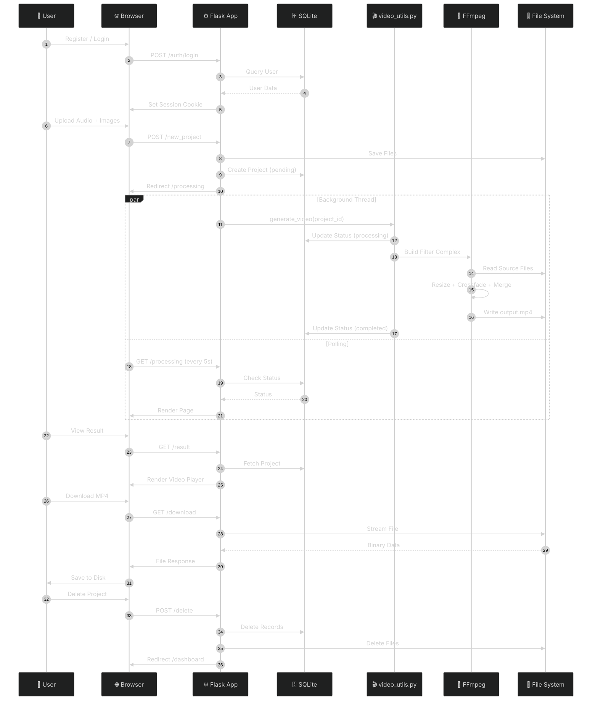

<div align="center">


<p>
  
  
  
  
</p>

<p>
  
  
</p>

</div>

---

## 🎬 Application Workflow


---

## 🧠 Neural Video Generation Engine



---

## 🧠 Neural Brain — Deep Processing Pipeline



---

## 🔄 Real-Time Processing State Machine



---

## 🏗️ System Architecture



---

## ⚡ Data Flow Architecture



---

## ✨ Feature Matrix

```mermaid
%%{init: {'theme': 'dark', 'themeVariables': { 'primaryColor': '#8b5cf6', 'primaryTextColor': '#fff', 'primaryBorderColor': '#7c3aed', 'lineColor': '#a78bfa', 'secondaryColor': '#f472b6', 'tertiaryColor': '#22d3ee', 'fontFamily': 'Inter'}}}%%
flowchart LR
    subgraph FEATURES["🚀 FEATURE ENGINE"]
        direction TB
        F1["🎵 Audio Sync<br/>auto_duration = audio_length / image_count<br/>Each image gets equal time"]
        F2["✨ Crossfade FX<br/>xfade=transition<br/>duration=0.5s<br/>smooth blending"]
        F3["🖼️ Smart Resize<br/>scale=1280:720<br/>force_original_aspect_ratio=decrease<br/>pad=black"]
        F4["🔒 Security Stack<br/>Bcrypt + CSRF + LoginManager<br/>Secure file handling"]
        F5["⚡ Background Thread<br/>threading.Thread<br/>Non-blocking UI<br/>Status polling"]
        F6["📱 Responsive UI<br/>Glassmorphism CSS<br/>Mobile-first design<br/>Particle animations"]
    end

    subgraph TECH["🛠️ TECH STACK"]
        direction TB
        T1["Python 3.8+"]
        T2["Flask + Jinja2"]
        T3["SQLite + SQLAlchemy"]
        T4["FFmpeg CLI"]
        T5["Vanilla JS/CSS3"]
    end

    FEATURES --> TECH

    style FEATURES fill:#8b5cf615,stroke:#8b5cf6,stroke-width:3px,color:#fff
    style TECH fill:#22d3ee15,stroke:#22d3ee,stroke-width:3px,color:#fff
```



---

## 🚀 Quick Start

```bash
# 1. Clone the repository
git clone https://github.com/issu321/Video-App.git
cd Video-App

# 2. Install FFmpeg (if not already installed)
# macOS: brew install ffmpeg
# Ubuntu: sudo apt install ffmpeg
# Windows: Download from ffmpeg.org and add to PATH

# 3. Install Python dependencies
pip install -r requirements.txt

# 4. Run the application
python app.py

# 5. Open browser → http://localhost:5000
```

---

## 📁 Project Structure

```
Video-App/
├── app.py              # Application entry point
├── config.py           # Configuration settings
├── extensions.py       # Flask extensions (DB, Login, Bcrypt, CSRF)
├── models.py           # Database models
├── routes.py           # All application routes
├── video_utils.py      # Video generation engine (FFmpeg)
├── requirements.txt    # Python dependencies
├── README.md           # This file
├── static/
│   └── css/
│       └── style.css   # Premium glassmorphism theme
├── templates/          # Jinja2 HTML templates
│   ├── base.html
│   ├── home.html
│   ├── login.html
│   ├── register.html
│   ├── dashboard.html
│   ├── new_project.html
│   ├── processing.html
│   └── result.html
└── uploads/            # File storage (auto-created)
    ├── audio/
    ├── images/
    └── output/
```

---

## ⚙️ Configuration

Edit `config.py` to customize:

| Parameter | Default | Description |
|---|---|---|
| `VIDEO_RESOLUTION` | `1280x720` | Output video dimensions |
| `VIDEO_FPS` | `24` | Frames per second |
| `VIDEO_TRANSITION_SECONDS` | `0.5` | Crossfade duration |
| `MAX_CONTENT_LENGTH` | `100MB` | Maximum upload size |

---

## 🛠️ Tech Stack

| Layer | Technology |
|---|---|
| **Backend** | Flask, Python 3.8+ |
| **Database** | SQLite, SQLAlchemy ORM |
| **Auth** | Flask-Login, Flask-Bcrypt, Flask-WTF (CSRF) |
| **Video Engine** | FFmpeg (subprocess) |
| **Frontend** | HTML5, CSS3, Jinja2, Vanilla JS |
| **UI Design** | Glassmorphism, Custom Animations |

---

## 🧑‍💻 Developer

<div align="center">

**Mohammed Usman**

*Full Stack Developer*

<p>
  <a href="https://github.com/issu321">
    
  </a>
  <a href="https://issu321.github.io/issu321">
    
  </a>
</p>

<p>
  <a href="mailto:jaafreeusman@gmail.com">
    
  </a>
  <a href="https://wa.me/918884294749">
    
  </a>
</p>

<p>
  <a href="https://github.com/issu321/Video-App">
    
  </a>
</p>

</div>

---

<div align="center">


<p align="center">
  Video Studio &copy; <span id="year"></span> — All rights reserved
</p>

<script>
  document.getElementById("year").textContent = new Date().getFullYear();
</script>

</div>
